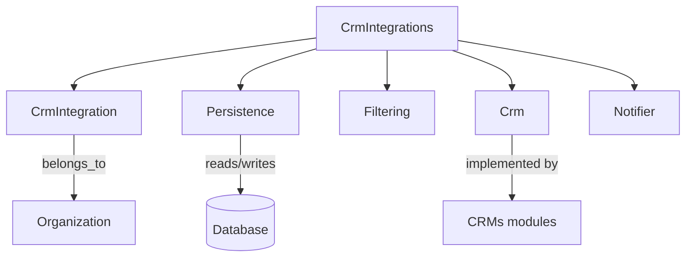

import HiddenH3 from "$components/typography/HiddenH3.astro"
import Asterism from "$components/typography/Asterism.astro"
import GithubInline from "$components/typography/GithubInline.astro"
export const components = {h3: HiddenH3}

## Business context and need

E**nchères Immo is a real estate auction platform** where I’ve worked since 2020, starting as an intern and now as software lead. Our clients are real estate agents, notaries, and other professionals who want to sell properties through online auctions. In a difficult period for the real estate market, we aim to help buyers and sellers find the best price quicker and transparently.

Elixir and Phoenix power our platform, from backend to frontend,<sup>1</sup> and their reliability and scalability are key to our success. One of my 2025 goals is to share more about our achievements and challenges <a href="/tag-elixir">with Elixir</a>.<side-note>1 — For example, I should write a post about how using a single language monolith helped us in a start-up context… And where are the limits?</side-note>

One key feature professionals asked for was the ability to import their properties. Most of them are used to spending time creating their properties and listings once in their favourite *<a href="https://en.wikipedia.org/wiki/Customer_relationship_management">Customer Relationship Management</a>* software (<abbr title="Customer Relationship Management">CRM</abbr>) and being able to export them to other platforms in one click.<sup>2</sup> Having to re-enter everything manually was a massive pain point for them, and none of our competitors offered a solution.<side-note>2 — We are talking about <abbr title="Customer Relationship Management">CRM</abbr>s specific to the real estate french market. They help professionals manage their properties, leads, and clients, at each step of the sales process. Professionals can also publish and manage their listings on major french marketplaces—like SeLoger or LeBonCoin.</side-note>

More than a way to attract new clients, linking our platform to those important actors in the real estate market has sometimes been the first step to a more in-depth collaboration. Integrating a technical ecosystem can be a way to integrate a business ecosystem ;)

However, the problem with industry-specific <abbr title="Customer Relationship Management">CRM</abbr>s is the lack of standardisation. Each has its own <abbr title="Application Programming Interface">API</abbr> (from modern <abbr title="REpresentational State Transfer">REST</abbr> <abbr title="Application Programming Interface">API</abbr>s to legacy <abbr title='File Transfer Protocol'>FTP</abbr> servers) with different data structures (<abbr title="JavaScript Object Notation">JSON</abbr>, <abbr title="Extensible Markup Language">XML</abbr>, <abbr title="Comma-Separated Values">CSV</abbr>), authentication methods, and documentation (or lack of). We had to support them all without having to rewrite the whole import process for each new <abbr title="Customer Relationship Management">CRM</abbr>, duplicating code and reducing maintainability…

## What's a behaviour?

In other programming languages, you might have encountered *interfaces* (Java, C#), *protocols* (Clojure, Swift), *traits* (Rust), or *abstract classes* (Python, C++). In Elixir, we have « *behaviours* ».

A behaviour defines a set of functions a module must implement. It enforces consistency across modules while enabling polymorphism.<sup>3</sup><side-note>3 — Polymorphism is the fancy word to describe the ability of a code to operate on different types of data.</side-note>

We start defining a behaviour with the `@callback` directive, which specifies the functions that must be implemented. Here, `greet/1` is the required function, which must take a string (`name`) and return another string:

```elixir
defmodule GreeterBehaviour do
  @callback greet(name :: String.t()) :: String.t()
end
```

To use this behaviour, we create modules that call the `@behaviour` directive and implement all the specified functions:<side-note>In the following example, the `@impl true` annotation is optional but highly recommended. It ensures you're explicitly implementing a behaviour-defined function.</side-note>

```elixir
defmodule EnglishGreeter do
  @behaviour GreeterBehaviour

  @impl true
  def greet(name), do: "Hello, #{name}!"
end

defmodule FrenchGreeter do
  @behaviour GreeterBehaviour

  @impl true
  def greet(name), do: "Bonjour, #{name}!"
end
```

From there, we can call any module implementing the `GreeterBehaviour` behaviour without knowing its implementation details:

```elixir
defmodule GreetingService do
  def send_greeting(module, name) when is_atom(module) do
    module.greet(name)
  end
end

GreetingService.send_greeting(EnglishGreeter, "Alice")
# "Hello, Alice!"

GreetingService.send_greeting(FrenchGreeter, "Alice")
# "Bonjour, Alice!"
```

While, contrary to those examples, behaviours are not the proper way to <a href="https://hexdocs.pm/gettext/">internationalise</a> your application, they are a powerful tool when polymorphism is needed... Like dealing with multiple industry-specific <abbr title="Customer Relationship Management">CRM</abbr>s!

## How we used behaviours

Let me introduce you to the final architecture of our <abbr title="Customer Relationship Management">CRM</abbr> integrations feature:



In this diagram, `CrmIntegrations` is the feature context module,<sup>4</sup> with most of the business logic and the `sync_integration` public function that triggers the import process. `CrmIntegration` is the schema module, representing the integration between an `Organization` and its <abbr title="Customer Relationship Management">CRM</abbr>.<side-note>4 — Learn more about our « Context-Driven Architecture » in *<a href="/2024/elixir-folder-structure#context-driven-architecture">Directory structure with Elixir</a>*.</side-note>

To avoid duplications and ensure maintainability, we contain <abbr title="Customer Relationship Management">CRM</abbr>-agnostic utilities in other modules: `Filtering` contains functions to prevent importing duplicate properties; `Persistence` is the module responsible for saving the properties in the database; and `Notifier` informs the user interfaces of the progress and errors in a human-readable way.

Finally, <abbr title="Customer Relationship Management">CRM</abbr> modules implement the `Crm` behaviour, which required functions implementing the <abbr title="Customer Relationship Management">CRM</abbr>-specific logic:

```elixir
defmodule EncheresImmo.CrmIntegrations.Crm do
  @moduledoc """
	This behaviour module provides functions to transform CRM-specific datas into
	Property changesets ready to be sent to Ecto.
  """

	# Aliases and imports...

	@doc """
	Transform raw datas (straight from the XML/CSV/JSON parser) into a list of raw
	"properties" (unparsed)
	"""
  @callback extract_property_list(str :: map) :: list
	@doc """
	Convert a raw property into a Property changeset
	"""
  @callback convert_property_map(
              property :: map,
              agent_id :: binary,
              integration :: CrmIntegration.t()
            ) :: map
	@doc """
	Get a unique identifier for a property (used to avoid duplicates)
	"""
  @callback get_source_id(property :: map) :: binary

  @doc """
  CRM codes are used as keys.
	This list is used as single source of truth in many parts of the code.
  """
  @crms %{
    "apimo" => %{type: :api, module: Apimo, name: "Apimo"},
    "hektor" => %{type: :xml, module: Hektor, name: "Hektor"},
    "twimmo" => %{type: :csv, module: Twimmo, name: "Twimmo"}
    # Other CRMs...
  }

	# Some utility functions to work with the @crms map...
end
```

For example, here an extract of the `Twimmo` module, implementing `convert_property_map/3` to parse <abbr title="Comma-Separated Values">CSV</abbr> raw data into a `Property` changeset:

```elixir
defmodule EncheresImmo.CrmIntegrations.Twimmo do
  @moduledoc """
  Module for handling Twimmo's CSV files, dropped in our FTP server.
	Format specification: SeLoger411.pdf
	"""
	@behaviour EncheresImmo.CrmIntegrations.Crm

	# Aliases and imports...

  # extract_property_list/1

  @impl true
  def convert_property_map(property, agent_id, integration) do
    photos = convert_pictures(property)
    agent_id = Crm.get_agent_id(integration, get_field(property, 106), agent_id)
		id = get_source_id(property)
    name = get_field(property, 19) |> :unicode.characters_to_binary(:latin1, :utf8)
    description = get_field(property, 20) |> :unicode.characters_to_binary(:latin1, :utf8)

    %Property{
      original_name: name,
      original_description: description,
      area: option(get_field(property, 15), 0) |> parse_integer(),
			# Other fields...
      crm_integration: %{
        source_id: id,
        source: integration.source,
        source_agency_id: integration.source_agency_id
      },
    }
  end

  @impl true
  def get_source_id(property) do
    "twimmo_#{get_field(property, 1)}"
  end

	# CSV doesn't have keys, so we have to rely on the column order
  defp get_field(property, index), do: Enum.at(property, index) |> clean_field()

  defp get_certificate(value) when value in ["A", "B", "C", "D", "E", "F", "G"], do: value
  defp get_certificate(_), do: "N/A"

  # Other utility functions...
end
```

Thanks to behaviours, we can focus on the parsing logic with almost no boilerplate code. The last step is to implement `get_raw_properties` with the <abbr title="Customer Relationship Management">CRM</abbr>-specific data retrieval logic...

### Sources and formats

<Asterism />

Modern <abbr title="Customer Relationship Management">CRM</abbr>s, like <a href="https://apimo.net/">Apimo</a>, use <abbr title="REpresentational State Transfer">REST</abbr> <abbr title="Application Programming Interface">API</abbr>s.<sup>5</sup> It's the best-case scenario, as we can use the `req` library to make standard <abbr>HTTP</abbr> requests and use the brand-new built-in Elixir <abbr>JSON</abbr> parser for the response.<side-note>5 — or GraphQL, supposedly.</side-note>

Here is an extract of the `Apimo` module, implementing `get_raw_properties`:

```elixir
  @impl true
  def get_raw_properties(
        agency_id,
        limit \\ 100,
        offset \\ 0,
        acc \\ []
      ) do
    case apimo_request(properties_endpoint(agency_id, limit, offset)) do
      {:ok, %Req.Response{body: body}} ->
        new_acc = (body["properties"] || []) ++ acc
        count = length(new_acc)
        total_items = body["total_items"]
				# We have to paginate the results
        if count < total_items do
          Logger.info(
            "#{__MODULE__}: syncing properties #{count} to #{if count + limit < total_items, do: count + limit, else: total_items} for agency #{agency_id}"
          )
          get_raw_properties(agency_id, limit, offset + limit, new_acc)
        else
          Logger.info("#{__MODULE__}: syncing done: #{count}")
          new_acc
        end

      error ->
			  CrmIntegrationNotifier.error(org_id)
        Logger.error("#{__MODULE__}: #{inspect(error)}")
        error
    end
  end

  defp apimo_request(endpoint) do
    Req.new(base_url: @base_url)
    |> Req.get(
      url: endpoint,
      headers: %{Authorization: "Basic " <> Base.encode64("#{apimo_provider()}:#{apimo_token()}")}
    )
  end
```

Sadly, the real estate world is not at the forefront of technology, and most <abbr title="Customer Relationship Management">CRM</abbr>s still use <abbr title='File Transfer Protocol'>FTP</abbr> servers to exchange data. This means running a server on our side, managing access for each <abbr title="Customer Relationship Management">CRM</abbr>, and parsing the files they drop in. Also, a user has to wait for its <abbr title="Customer Relationship Management">CRM</abbr> to send the file, which can take up to 24 hours…<sup>6</sup><side-note>6 — This is one of the leading ticket generators for our customer success team, as users expect properties to be imported in real time, and often blame us for the delay.</side-note>

We use <GithubInline user="10390169" />'s <a href="https://github.com/encheres-immo/fly-ftp-server">custom client</a> for <a href="https://fly.io/">Fly.io</a>, build on top of <a href="https://hub.docker.com/r/delfer/alpine-ftp-server">alpine-ftp-server</a> and <a href="https://en.wikipedia.org/wiki/Vsftpd">vsftpd</a>. Accesses are managed by a environment variable, with a folder per <abbr title="Customer Relationship Management">CRM</abbr>. We put all related utilities, like `FTP.get_files/2`, in a `FTP` module.

Here is an extract of the `Twimmo` module, implementing `get_raw_properties`:

```elixir
  @impl true
  def get_raw_properties(agency_id) do
    with {:ok, files} <- FTP.get_files("twimmo", agency_id),
				 file <- Enum.find(files, fn file -> file == "Annonces.csv" end),
				 {:ok, content} <- File.read(file) do
			content |> SeLogerParser.parse_string()
		else
			error ->
			  CrmIntegrationNotifier.error(org_id)
				Logger.error("#{__MODULE__}: #{inspect(error)}")
				error
		end
	end

  NimbleCSV.define(SeLogerParser,
    separator: "!#",
    escape: "\"",
    newlines: ["\r\n"],
    moduledoc: """
		(... Specification details)
		"""
	)
```

In this example, we use <a href="https://hexdocs.pm/nimble_csv/NimbleCSV.html">NimbleCSV</a> to parse the <abbr title="Comma-Separated Values">CSV</abbr> file, a simple library that allows you to define multiple parsers to handle different <abbr title="Comma-Separated Values">CSV</abbr> formats.<sup>7</sup> We also use <a href="https://hexdocs.pm/sweet_xml/SweetXml.html">sweet-xml</a> to parse the <abbr title="Extensible Markup Language">XML</abbr> files.

<side-note class="lg:-mt-[34rem]">
```csv wrap
!#""!#""!#""!#""!#""!#""!#""!#""!#""!#""!#""!#""!#"235922"!#"0"!#""!#"0"!#""!#""!#""!#""!#""!#""!#""!#""!#""!#""!#"NON"!#"NON"!#""!#"NON"!#""!#""!#""!#""!#"NON"!#""!#""!#""!#""!#""!#""!#""!#""!#""!#""!#""!#"NON"!#"NON"!#""!#""!#""!#"NON"!#""!#""!#""!#""!#""!#""!#"NON"!#"0"!#"0"!#"NON"!#""!#""!#""!#""!#""!#""!#""!#""!#""!#""!#""!#""!#""!#""!#""!#""!#""!#""!#""!#""!#""!#""!#""!#""!#""!#""!#""!#""!#""!#""!#""!#""!#""!#"0"!#"0"!#""!#"0"!#"0"!#"1"!#"4.08-006"!#""
```
7 — Extract from a SeLoger-compliant <abbr title="Comma-Separated Values">CSV</abbr> file. Probably for someone's job security, they use a custom `!#""` delimiter, and `OUI`/`NON` for booleans. And since the format lacks keys, you have to rely on the column order, hence all the empty and `NON` values...
</side-note>

And that's it! We can import properties from any <abbr title="Customer Relationship Management">CRM</abbr> with minimal effort, from <abbr title="REpresentational State Transfer">REST</abbr> <abbr title="Application Programming Interface">API</abbr>s to <abbr title='File Transfer Protocol'>FTP</abbr> servers, with different data structures.

### User interface and error handling

<Asterism />

Show how we recover the number of properties imported and the number of errors.

Show the info message during and after the import, on the agency and admin side.

Detailled error logs with AppSignal.

## Conclusion

Our world is spooky, filled with legacy systems and non-standard data structures… But our <abbr title="Customer Relationship Management">CRM</abbr> integration feature has been up and running for almost 3 years, with multiple refactors from different team members, eight different <abbr title="Customer Relationship Management">CRM</abbr>s supported, thousands of properties imported, and many happy users.

This real case study shows that Elixir behaviours are a powerful tool to handle polymorphism and ensure maintainability, even in a complex feature. If we need to add a new <abbr title="Customer Relationship Management">CRM</abbr> tomorrow, we can do it in a few hours, with minimal effort and no risk of breaking the existing ones.

I hope this entry will help you handle different data sources in your projects. The hardest part is often obtaining the documentation and testing files from the providers… But that's another story!
