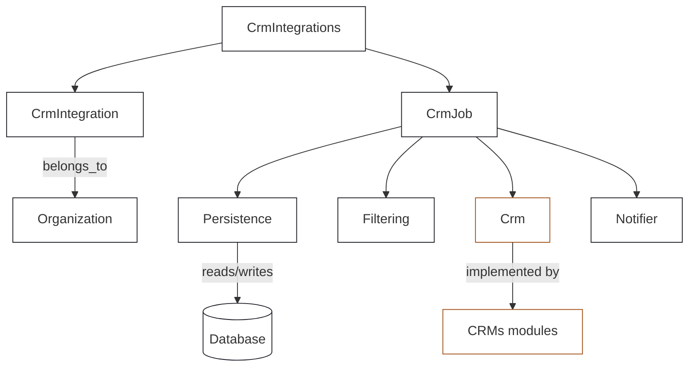

## CRM integration — components diagram

Light:

```mermaid
flowchart TB
		A[CrmIntegrations] --> B[CrmIntegration]
		B -->|belongs_to| O[Organization]
		A --> C[CrmJob]
		C --> D[Persistence]
		C --> E[Filtering]
		C --> F[Crm]
		C --> G[Notifier]
    D -->|reads/writes| DB[(Database)]
		F -->|implemented by| H[CRMs modules]
		style A fill:#fff, stroke:#1C1E26
		style B fill:#fff, stroke:#1C1E26
		style C fill:#fff, stroke:#1C1E26
		style D fill:#fff, stroke:#1C1E26
		style E fill:#fff, stroke:#1C1E26
		style F fill:#fff, stroke:#A25219
		style G fill:#fff, stroke:#1C1E26
		style H fill:#fff, stroke:#A25219
		style O fill:#fff, stroke:#1C1E26
		style DB fill:#fff, stroke:#1C1E26
```

Dark:

```mermaid
flowchart TB
		A[CrmIntegrations] --> B[CrmIntegration]
		B -->|belongs_to| O[Organization]
		A --> C[CrmJob]
		C --> D[Persistence]
		C --> E[Filtering]
		C --> F[Crm]
		C --> G[Notifier]
    D -->|reads/writes| DB[(Database)]
		F -->|implemented by| H[CRMs modules]
		style A fill:#1C1E26
		style B fill:#1C1E26
		style C fill:#1C1E26
		style D fill:#1C1E26
		style E fill:#1C1E26
		style F fill:#1C1E26, stroke:#FAC29AE6
		style G fill:#1C1E26
		style H fill:#1C1E26, stroke:#FAC29AE6
		style O fill:#1C1E26
		style DB fill:#1C1E26
```

